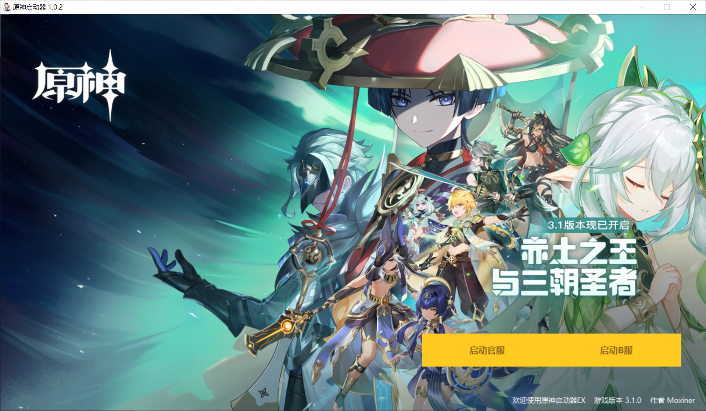

# YuanShenEX_Launcher
一个可以选择服务器的原神启动器


## 🎁 原神启动器EX 是什么
### 这是一个可以在启动时任意选择进人官服或B服的启动器！



## 🏆 原神启动器EX 的优势
### 为什么选择我们
* 不封号 不修改破坏游戏数据
* 外观美观 近似原版的启动器让您很快上手
* 双服共用一个游戏资源 为您省下 50G+ 的存储空间
* 一键换服 切换服务器方便
### 与原版比，我们的优点
|功能 |原版启动器 |原神启动器EX
----|----|----|
|推送更新|✔|❌
|服务器选择|❌|✔
|占用内存小|约400MB|约200MB
|配置简单|❌|✔
|更多功能|❌|✔

* B服玩家甚至被抛弃了

## 📚 使用说明
### 【Step 1】下载启动器压缩包
* 请 👉[点击此处](https://github.com/Moxiner/YuanShenEx_Launcher/releases)👈 下载压缩包
### 【Step 2】解压压缩包
* 解压放到合适位置

### 【Step 3】原神，启动！
* 双击 ``` 原神启动器Ex.exe```


```
一般 
原版启动器的文件夹名为 Genshin Impact 
游戏根目录文件夹为 Genshin Impact Game
看到有派蒙图标的 YuanShen.exe 说明这就是游戏根目录 ，意味着你找对了！

例如： G:\Genshin Impact\Genshin Impact Game
```

#### 游戏根目录示例截图


### 【Step 3】打开 Launcher.exe
* 选择您要进入的服务器
* 同意安全权限
* 等待游戏启动

### 【Step X】背景图片自定义
* 背景图片是 ``` YuanShenEx/src/```
* 背景的图片分辨率为 ``` 1270X730```
* 可以在 【设置 ➡️ 背景图片】 中修改

## ✨ FQA
* Q: 原神启动器Ex 安装目录在哪？
  * A：在游戏目录 Genshin Impart Game 的同级目录 YuanShenEx 下
* Q：弹出报错```未找到配置文件，请...```怎么办？
  * A：这说明你找错游戏根目录文件夹了，请结合搜索引擎自行找到，实在不会可以联系 Moxiner 
* Q：弹出报错```缺少资源文件 XXX ,请...```怎么办？
  * A：请重新安装！
* Q：启动速度慢？
  * A：理论上，原神启动器EX 和 原版启动器启动速度持平，如果启动速度慢绝对不是因为原神启动器EX的原因 （除非给出证据）
* Q：启动B服出现 ```解析二级地址错误```怎么办？
  * A：请单击启动器中的一键修复！
* Q：游戏出现以下报错 ```数据异常，请完全卸载游戏,并从官方渠道重新下载安装错误码:31-4302```怎么办？
  * A：请单击启动器中的一键修复！实在不行，请检查 Genshin Impact Game 中是否有多余文件 （如 src / Launcher.exe /Installer.exe）如果有，请删除！
* Q：游戏出现  ```未知错误```怎么办？
  * A：请提交至 👉[GitHub Issues](https://github.com/Moxiner/YuanShenEx/issues)👈 \ 或 [QQ群](👉https://jq.qq.com/?_wv=1027&k=1rvEyeSA👈)
(≧∇≦)ﾉ


## 📑 版权许可
* 原神启动器EX是《原神》游戏的拓展游戏插件，程序本身版权归 莫欣儿&原琴刻晴师傅 所有
* 启动器背景图资源文件归 上海米哈游天命科技有限公 司所有
* 原神启动器的图标是在网络中意外发现，无法联系到版权人，侵删！


* 您在使用本项目同时，需遵守 GPL 3.0 许可协议，同时需额外遵循以下补充要求
  * 本项目仅供参考学习，莫欣儿&原琴刻晴师傅不会对您使用本项目产生的任何后果负责
  * 本项目为开源项目，项目及其衍生项目不得商用
  * 本项目可以转载，但请联系 莫欣儿&原琴刻晴师傅&原琴刻晴师傅 授权（无特殊情况一定会授权的！(●ˇ∀ˇ●)）并在明显地方标明由此出处
* 有什么问题、建议、反馈 ，请提交至 👉[Gitte Issues](https://gitee.com/Morbid-zj/yuanShenEx/issues)👈 \ 或 [QQ群](👉https://jq.qq.com/?_wv=1027&k=1rvEyeSA👈)
(≧∇≦)ﾉ

## 🎭 参与开发人员&鸣谢名单

|       |  |
| :------------------------------------------------------------------:  | :------------------------------------------------------------------: |
|              [@Moxiner](https://github.com/Moxiner)                    |              [@Morbid](https://gitee.com/Morbid-zj)                  |                       


感谢 [zhiyiYo](https://github.com/zhiyiYo) 提供 [PyQt-Fluent-Widgets](https://github.com/zhiyiYo/PyQt-Fluent-Widgets) 的 UI 框架

 🏷️Tips: QFluentWidgets Pro is now released. Click https://qfluentwidgets.com/pages/pro to learn more about it.

___Copyright © 2022 Moxiner And Morbid (or Moxiners). All Rights Reserved.___
